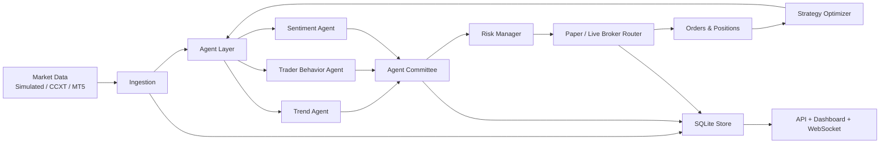

# Multi-AI Agent Trading System

ระบบนี้เป็น MVP สำหรับวิเคราะห์ข้อมูลตลาดแบบ real-time, ประมวลผลด้วยหลาย AI/agent, คุมความเสี่ยง, ส่งคำสั่งแบบ paper trading และเปิดทางให้ต่อ crypto, forex และ gold ผ่าน broker adapters ได้ในอนาคต

ค่าเริ่มต้นทั้งหมดเป็น `paper` เพื่อป้องกันการส่งคำสั่งจริงโดยไม่ได้ตั้งใจ การเปิด live trading ต้องตั้งค่า `EXECUTION_MODE=live` และ `LIVE_TRADING_CONFIRM=true` เอง

## ความสามารถหลัก

- รองรับสินทรัพย์ 3 กลุ่ม: crypto, forex, gold
- Market data provider แบบ simulated, CCXT และ MT5
- Multi-agent analysis: trend, trader behavior, sentiment
- Trader behavior analysis: volatility, spread, volume delta, crowding, anomaly, market regime
- 3D agent operations dashboard สำหรับดูว่า agent แต่ละฝ่ายกำลังทำอะไรอยู่
- Agent committee รวมสัญญาณและคำนวณ confidence
- Record Keeper Agent สำหรับเก็บบันทึก tick/signal/decision context
- Technical Development Agent สำหรับติดตามสุขภาพกลยุทธ์และ backlog การพัฒนาระบบเทรด
- Risk manager คำนวณ position size จาก stop loss และจำกัด exposure
- Paper broker สำหรับทดสอบ order flow
- Continuous Strategy Optimization ปรับ risk, threshold และ window จากผลลัพธ์ย้อนหลัง
- SQLite storage สำหรับ ticks, behavior snapshots, signals, decisions และ orders
- FastAPI endpoints และ dashboard real-time ที่ `/`

## สถาปัตยกรรม



## การรันเดโม

```powershell
$env:PYTHONPATH='src'
python -m multi_ai_trading.cli demo --ticks 180 --db runtime/demo.sqlite
```

## การรัน API และ dashboard

ติดตั้ง dependency ก่อน:

```powershell
pip install -r requirements.txt
```

เริ่ม server:

```powershell
$env:PYTHONPATH='src'
python -m multi_ai_trading.cli serve --port 8000
```

เปิด dashboard:

```text
http://127.0.0.1:8000/
```

Endpoints ที่ใช้บ่อย:

- `GET /health`
- `GET /state`
- `POST /control/start`
- `POST /control/stop`
- `GET /storage/ticks?limit=50`
- `GET /storage/orders?limit=50`
- `WS /ws/state`

## การตั้งค่า

คัดลอกจาก `.env.example` แล้วตั้งค่า environment variables ที่ต้องใช้:

```powershell
Copy-Item .env.example .env
```

ตัวอย่าง symbols:

```text
SYMBOLS=BTC/USDT:crypto,EURUSD:forex,XAUUSD:gold
```

ตัวอย่างโหมด:

```text
FEED_MODE=simulated
EXECUTION_MODE=paper
```

สำหรับ crypto real market data ใช้:

```text
FEED_MODE=ccxt
CCXT_EXCHANGE=binance
```

สำหรับ forex/gold real market data ใช้:

```text
FEED_MODE=mt5
MT5_PATH=C:\Program Files\MetaTrader 5\terminal64.exe
MT5_PORTABLE=false
MT5_LOGIN=...
MT5_PASSWORD=...
MT5_SERVER=...
```

ถ้าใช้ portable MT5 demo ให้ตั้ง `MT5_PATH` ไปที่ `terminal64.exe` ของ portable terminal และใช้ `MT5_PORTABLE=true`

## Live Trading Guardrails

ระบบยังไม่ส่งคำสั่ง live จริงโดยตรงใน MVP นี้ `LiveBrokerRouter` จะ reject order จนกว่าจะเพิ่ม broker implementation เฉพาะทาง เช่น CCXT order execution หรือ MT5 order send และต้องเปิด `LIVE_TRADING_CONFIRM=true`

แนวทางที่ควรเพิ่มก่อน live:

- broker-specific order adapter พร้อม retry และ idempotency
- max slippage และ spread filter ต่อสินทรัพย์
- kill switch รายวันและรายบัญชี
- execution audit log แยกจาก strategy log
- backtest และ walk-forward validation ต่อ strategy version
- paper-to-live shadow mode อย่างน้อย 1-2 สัปดาห์

## การทดสอบ

```powershell
$env:PYTHONPATH='src'
python -m unittest discover -s tests
```

## โครงไฟล์

```text
src/multi_ai_trading/
  agents/          multi-agent signal generation
  api/             FastAPI dashboard and endpoints
  data/            market data providers and SQLite store
  config.py        environment-driven config
  domain.py        shared dataclasses and enums
  execution.py     paper broker and live broker guard
  optimizer.py     continuous strategy optimization
  orchestrator.py  end-to-end trading loop
  risk.py          risk checks and position sizing
  strategy.py      committee signal aggregation
```

คำเตือน: โค้ดนี้เป็นระบบ engineering scaffold สำหรับพัฒนาและทดสอบ ไม่ใช่คำแนะนำการลงทุน และไม่ควรนำไป live trading ก่อนผ่าน backtest, forward test และ broker-specific validation.
